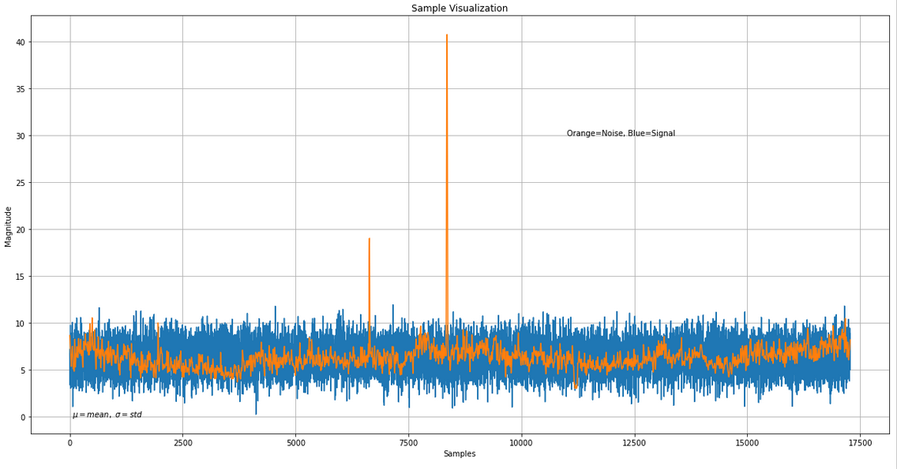
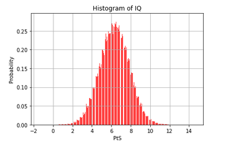

#  Solar Flare Predictors 
## Gaussian noise for modeling solar activity

## Features

## Datasets details
* Site = AGO
* Contact = rok.vogrincic@fmf.uni-lj.si
* Country = SLOVENIA
* Longitude = 14.53
* Latitude = 46.04
* UTC_Offset = +01:00
* TimeZone = Central European Time (CET)
* UTC_StartTime = 2020-03-26 00:00:00
* LogInterval = 5
* LogType = filtered
* MonitorID = 9190
* SampleRate = 5
* StationID = DHO
* Frequency = 23400
* UTC_EndTime=2020-03-26 23:59:55
* DataMin=3.03025831131
* DataMax=40.7316472846
* dataquality_average_v0.1=0.557058 
* dataquality_max_v0.1=25.435353

# Deploy on Docker

`docker build -t image .`

`docker run -it -v ~/SolarFlares-Standford/model:/sebasmos/model -v ~/SolarFlares-Standford/data:/sebasmos/data: sebasmos bash`

`python test.py data/ model/`

# Solar flare forecasting papers
* [Operational solar flare prediction model using Deep Flare Net](https://earth-planets-space.springeropen.com/articles/10.1186/s40623-021-01381-9): DeFN provides probabilistic forecast for M-class and C-class events during 24h subsequent hours from current day. Dataset is extracted from Solar Dynamic Observatory (SDO) 
