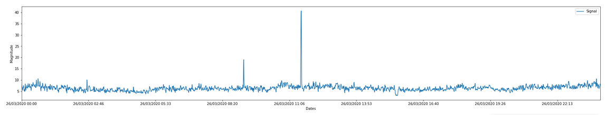
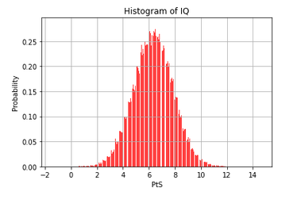

# Caracterizar llamaradas solares tipo A,B,C y X
Señal del sol - base de datos de StandFord

# Analisis Gaussiano con caracteristicas de senal solar

# Analisis de histograma de caracteristicas ppales del sol

## Atributos principales
* Site = AGO
* Contact = rok.vogrincic@fmf.uni-lj.si
* Country = SLOVENIA
* Longitude = 14.53
* Latitude = 46.04
* UTC_Offset = +01:00
* TimeZone = Central European Time (CET)
* UTC_StartTime = 2020-03-26 00:00:00
* LogInterval = 5
* LogType = filtered
* MonitorID = 9190
* SampleRate = 5
* StationID = DHO
* Frequency = 23400
* UTC_EndTime=2020-03-26 23:59:55
* DataMin=3.03025831131
* DataMax=40.7316472846
* dataquality_average_v0.1=0.557058 
* dataquality_max_v0.1=25.435353
